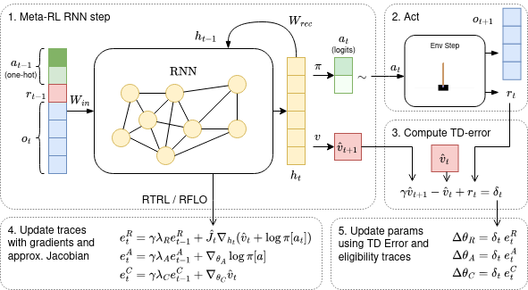
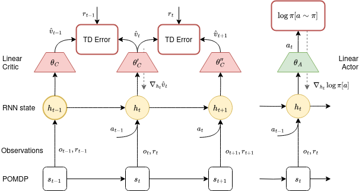

# Real-Time Recurrent Reinforcement Learning

Code Appendix for the Paper "[Real-Time Recurrent Reinforcement Learning](https://arxiv.org/abs/2311.04830)" accepted for AAAI 2025.

## Install

1. Install Poetry: https://python-poetry.org/docs/#installation
2. Install dependencies using `poetry install`
3. Launch poetry shell: `poetry shell`

## Run

```
python rtrrl.py
```

## Loggging

You can log results using [`aim`](https://aimstack.readthedocs.io/en/latest/index.html) or [`wandb`](https://wandb.ai/). By default no logging framework is installed.

After installing the respective package, you can enable logging by providing the `--logging` argument. 

```
pip install aim
python rtrrl.py --logging aim
```

## CUDA support

A GPU can speed up training when using large batch sizes but will slow it down for smaller ones. 

Make sure to install the CUDA version of `jax` and `jaxlib`. 

```
    pip install jax[cuda]
```

## Algorithm



## Hyperparameters
| Symbol      | Description                          | Default Value |
| ----------- | ------------------------------------ | ------------- |
| $\gamma$    | Discount factor.                     | 0.99          |
| $\alpha_{TD}$  | TD($\lambda$) learning rate.                 | 1e-5          |
| $\alpha_R$  | RNN learning rate.                   | 1e-5          |
| $\eta_H$    | Entropy rate.                        | 1e-5          |
| $\eta_A$    | Actor trace scaling.                        | 1.0          |
| $\lambda_A$ | Lambda for actor eligibility trace.  | 0.99           |
| $\lambda_C$ | Lambda for critic eligibility trace. | 0.99           |
| $\lambda_R$ | Lambda for RNN eligibility trace.    | 0.99          |




## Configurables
This is an incomplete table of configurables.
Run `poetry run python rtrrl.py --help` to find out more.

There is a preset for `brax` environments that can be used by providing the config path:

```
python rtrrl.py --config_path configs/brax.yml
```

|Name | Description | Default Value |
| --- | ------- | -------- |
|debug| Enables debugging functionality. |False|
|env_name | Environment ID as defined by `gymnax` | 'CartPole-v1' |
|obs_mask| Allows masking of observation. Allowed values are None, 'even', 'odd', 'first_half' or a List of indices. | None|
|env_init_args| Arguments passed to environment constructor (e.g. size=16 for `DeepSea-bsuite`)   | - |
|env_params| Environment parameters passed to `step` and `reset` methods. (e.g. memory_length=32 for `MemoryChain-bsuite`) | - |
|rnn_model| Determines which RNN model is used. Set to None for vanilla TD($\lambda$). | 'CTRNN_simple'|
|hidden_size| RNN hidden state size. | 16|
|seed| Random seed for jax. Set to `None` for a random integer. |None|
|optimizer_params_td.opt_name| Optimizer used for tD($\lambda$). |'adam'|
|optimizer_params_rnn.opt_name| Optimizer used for the RNN. |'adam'|
|episodes| Total training episodes. |150_000|
|eval_every| Number of episodes between evaluation. |100|
|eval_steps| Number of evaluation steps. |10000|
|steps| Number of training steps per episode. |10000|
|max_ep_length| Max number of steps in episode. Specific environments may supersede this. |1000|
|patience| Early stopping is triggered after this number of evaluation episodes without improvement. |20|
|batch_size| Number of parallel environments. | 1|
|eta| Can be used for infinite horizon tasks. If set, average reward $\bar r$ is maintained and updated as $\bar r \gets \bar r + \eta\ \delta$. | None| 
|eta_pi| Scale gradients of action probability passed to RNN. | 1|
|eta_f| Scale gradients of RNN. | 1|
|entropy_rate| Scale gradient of action entropy. | 1|
|var_scaling| If True, scales the gradients of action probability by the scale of the action distribution. Only works for continuous actions. | False|
|gradient_mode| Select method for online gradient computation: 'RTRL', 'RFLO' or 'LocalMSE'. Ignored when LRU is used for `rnn_model`.| 'RFLO'|
|trace_mode| Type of eligibility trace. 'accumulate' or 'dutch'  | 'accumulate'|
|wiring| Specify wiring of RNN. See `modles/jax/wirings_jax.py` for available options. | 'fully_connected'|
|dt| Determines number of steps for forward Euler. e.g. 0.2 results in 5 steps. | 1|


